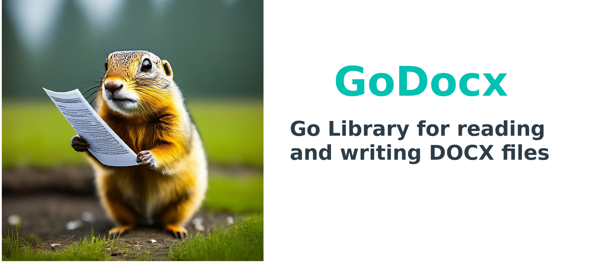

# Godocx

[](https://github.com/gomutex/godocx/actions/workflows/go.yml)  [](https://pkg.go.dev/github.com/gomutex/godocx)
 [](https://goreportcard.com/report/github.com/gomutex/godocx) [](https://opensource.org/licenses/MIT)


<p align="center"></p>


Godocx is a library written in pure Go providing a set of functions that allow you to write to and read from Docx file. 

This library needs Go version 1.18 or later. The usage documentation for the godocx can be accessed via the [Godocx Documentation Page](https://gomutex.github.io/godocx). 

In depth, go docs can be seen using go's built-in documentation tool, or online at [go.dev](https://pkg.go.dev/github.com/gomutex/godocx). Please refer the [subpackage docx](https://pkg.go.dev/github.com/gomutex/godocx/docx) for the list of functions that can be used.


## Usage
Here's a simple example of how you can use Godocx to create and modify DOCX documents:

## Installation
Use the godocx in your project
```bash
go get github.com/gomutex/godocx
```


### Examples
Explore additional examples and use cases over at GitHub repository dedicated to showcasing the capabilities of Golang Docx:
https://github.com/gomutex/godocx-examples


```go
// More examples in separate repository
// https://github.com/gomutex/godocx-examples

package main

import (
	"log"

	"github.com/gomutex/godocx"
)

func main() {
		// Open an existing DOCX document
	// document, err := godocx.OpenDocument("./testdata/test.docx")

	// Create New Document
	document, err := godocx.NewDocument()
	if err != nil {
		log.Fatal(err)
	}

	document.AddHeading("Document Title", 0)

	// Add a new paragraph to the document
	p := document.AddParagraph("A plain paragraph having some ")
	p.AddText("bold").Bold(true)
	p.AddText(" and some ")
	p.AddText("italic.").Italic(true)

	document.AddHeading("Heading, level 1", 1)
	document.AddParagraph("Intense quote").Style("Intense Quote")
	document.AddParagraph("first item in unordered list").Style("List Bullet")
	document.AddParagraph("first item in ordered list").Style("List Number")

	records := []struct{ Qty, ID, Desc string }{{"5", "A001", "Laptop"}, {"10", "B202", "Smartphone"}, {"2", "E505", "Smartwatch"}}

	table := document.AddTable()
	table.Style("LightList-Accent4")
	hdrRow := table.AddRow()
	hdrRow.AddCell().AddParagraph("Qty")
	hdrRow.AddCell().AddParagraph("ID")
	hdrRow.AddCell().AddParagraph("Description")

	for _, record := range records {
		row := table.AddRow()
		row.AddCell().AddParagraph(record.Qty)
		row.AddCell().AddParagraph(record.ID)
		row.AddCell().AddParagraph(record.Desc)
	}

	// Save the modified document to a new file
	err = document.SaveTo("demo.docx")
	if err != nil {
		log.Fatal(err)
	}
}
```

## Demo Output

This is screenshot of demo document generated from the godocx library. 


## Feature addtion request

If you need a feature that's missing in godocx, feel free to raise an issue describing what you want to achieve, along with a sample DOCX. While I can't promise immediate implementation, I'll review your request and work on it if it's valid.


## Inspiration
The Godocx library is inspired from the python-docx

## Licenses

The Godocx library is licensed under the [MIT License](https://opensource.org/licenses/MIT).
